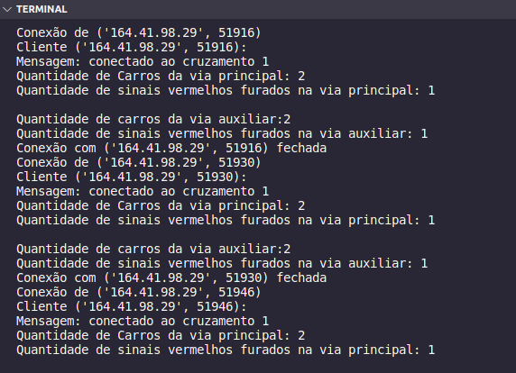
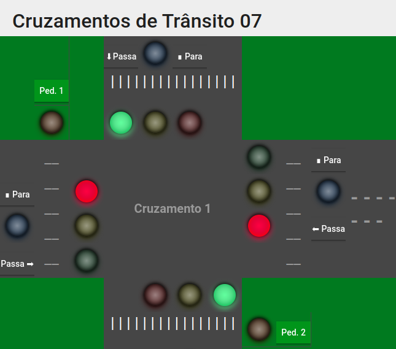
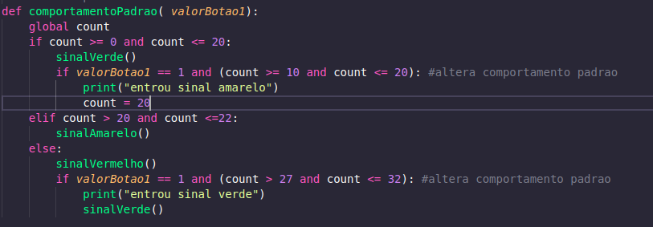
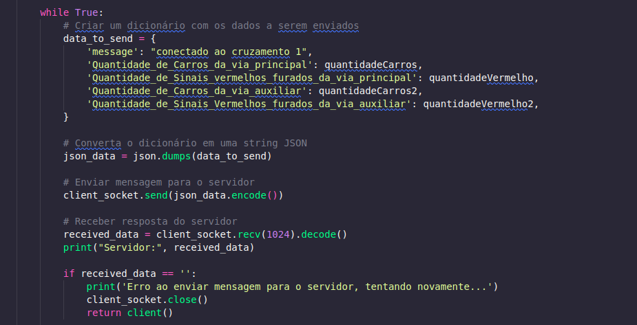
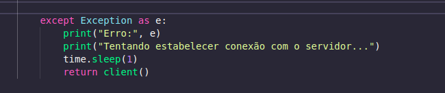
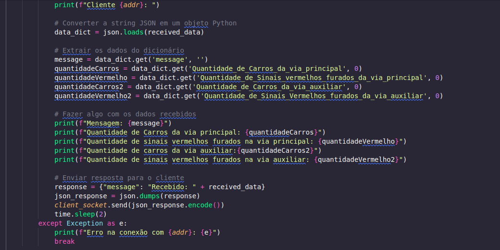
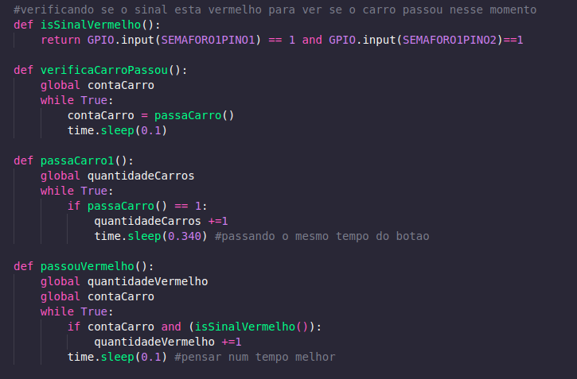
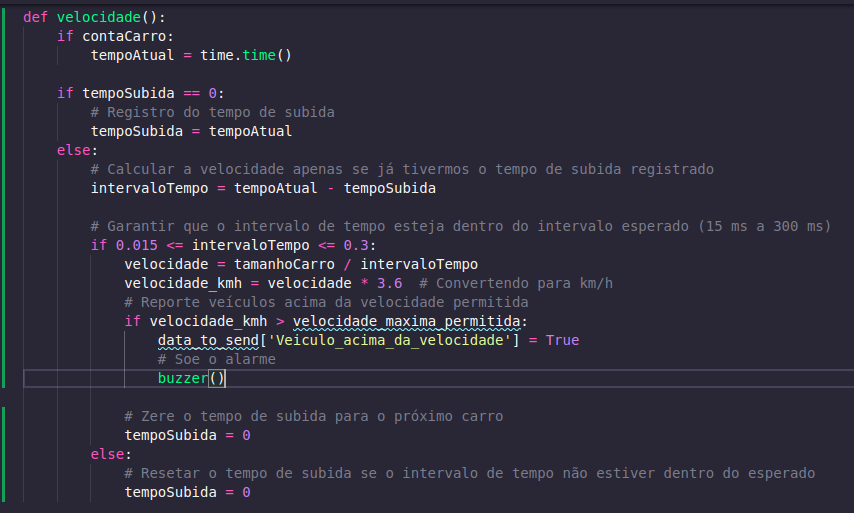

# Trabalho 1 (2023-2)

Trabalho 1 da disciplina de Fundamentos de Sistemas Embarcados (2023/2)

## 1. Aluno

**Nome**: Lucas Felipe Soares

**Matrícula**: 202016767

**Semestre**: 2023.2

## 2. Vídeo

O vídeo a seguir trata-se de uma breve apresentação sobre a arquitetura do projeto e como algumas lógicas e soluções foram pensadas: 

[Link do vídeo](https://youtu.be/rbr0ftX7OKA)

## 3. Como rodar o projeto:

**Pré-Requisito**: **Python3**

Em vista da arquitetura do projeto, no qual optei por seguir com 3 arquivos executáveis, é necessário que se rode cada um dos 3 de maneira distinta. Começando é claro pelo servidor Central e posteriormente pelos dois servidores distribuídos (cruzamento 1 e cruzamento 2). A seguir mostrarei caminhos de se fazer essa execução:

### 1° passo: Conectar-se a placa.

É necessário que se utilize o comando de SSH para se conectar na placa, é importante que seja a mesma placa no qual os HOSTS apontam, como por exemplo: ```164.41.98.29``` para a placa 7. O comando a ser executado no terminal é: ```ssh <usuario>@<ip-raspberry-pi> -p 13508```

### 2° passo: enviar os arquivos para a placa.

É necessário que se utilize o comando de SCP para enviar os arquivos do repositório para que eles sejam executados na placa. O comando para se executar no terminal é: ```scp -P 13508 -r ./diretorio <usuário>@<ipPlaca>:~/```

### 3° Passo - Executar os arquivos

Com os arquivos enviados para a placa é necessário em terminais diferentes executar esses três comandos:

#### ```python3 central.py```

#### ```python3 cruzamento1.py```

#### ```python3 cruzamento2.py```

obs: é necessário se conectar e enviar os arquivos em cada terminal.

### Passo alternativo

Caso não seja possível executar os arquivos é possível após a conexão com a placa se utilizar o comando: 
```nano central.py``` colar o conteúdo do arquivo central.py dentro do nano, salv-lo e executar utilizando: 
```python3 central.py``` e executa-lo. A ideia seria similar aos outros arquivos, conecta outros dois terminais e repete o processo com os respectivos arquivos.

## 4. Imagens da execução

Na imagem a seguir veremos um exemplo de como é feita a comunicação entre o servidor central e os distribuídos com o print dos dados recebidos:



Já nessa imagem a seguir veremos como os semaforos da via principal e via auxiliar estão sincronizados de forma que ambos funcionam em tempos opostos para se evitar colisões:



## 5. Lógicas pertinentes:

#### Temporizadores dos semaforos

Uma das lógicas mais importantes do projeto trata-se da temporização dos semaforos. Para a execução da mesma eu criei uma váriavel global responsável pela contagem dos segundos, em situações onde por exemplo um pedrestre não apertasse o botão, todos os semaforos funcionariam em seus tempos máximos. Agora caso um botão seja acionado, uma várivel responsável pela veificação do estado do botão é acionada e alterando os tempos dos semaforos para o tempo mínimo (isso ocorre durante os sinais verdes e vermelhos). Como não via auxiliar os semaforos seguem padrão de tempos opostos, utilizo da mesma lógica mas iniciando o semaforo pelo sinal vermelho e os tempos máximos e mínimos são invertidos.



#### Funcionamento comunicação TCP-IP

Para a execução da comunicação entre os servidores distribuidos e o servidor central, utilizei uma função denominada **client()** que fica em meus servidores distribuidos e uma função denominada **server()** que fica em meu servidor central. Dentro do meu client, crio um dicionário de dados utilizando json e posteriormente com a função: **client_socket.send(json_data.encode())** envio esses dados para o servidor central via socket. Na imagem abaixo veremos como se da essas conversões e envio:



Finalizando essa função de client, temos o requisito de caso seja perdido a conexão, ele tentar restabelecer a comunicação novamente:



Já tratando a função **server()**, extraimos os dados recebidos em json e com esses dados extraidos mandamos mensagem via interface de terminal com esses dados para o client, na primeira imagem vemos esse resultado. Na imagem a seguir veremos sobre essa implementação: 



#### Funcionamento dos sensores

Para o funcionamento dos sensores, criamos uma variável responsável por receber o estado que o pino dos sensores se encontra(essa é a mesma lógica que utilizamos para saber se o botão foi apertado ou não nos semaforos). Caso o sensor esteja ativo, é sinal que se passou um carro e podemos incrementar essa váriavel. Para o caso de furar um sinal vermelho (uma das situações de multa), verificamos se um carro passou e verificamos se naquele instante de tempo o semaforo se encontrava vermelho. A seguir veremos essas funções com mais detalhes: 



## 6. Lógicas criadas mas não testadas

Nessa sessão, estou trazendo bases de código que cheguei a fazer mas por conta do grande volume de pessoas utilizando as placas e pouco tempo para tratar elas preferi por deixar de fora da versão final do código.

## Calcula Velocidade média e situação de multa por velocidade

Basicamente a ideia dessa função era verificar se um carro passou, e com isso marcar utilizando a função **time.time()** o tempo de início para podermos ver exatamente o intervalo de tempo gasto. Com isso utilizo a fórmula de dividir os 2 metros do carro pelo intervalo de tempo para encontrar a velocidade em m/s, no qual multiplico por 3,6 ao final para ter na unidade de medida **km/hr**. Zero meus tempos de subida e descida para poder pegar novos carros. Obs: A ideia seria que o buzzer chamado emitisse som caso a velocidade fosse maior que a velocidade máxima permitida da via para confirmar um caso de multa por exemplo, ainda utilizava o data_to_send dentro da função pois ainda estava aprendendo em como se utilizar o json dentro do projeto. Na imagem a seguir, veremos como havia deixado esse código:

